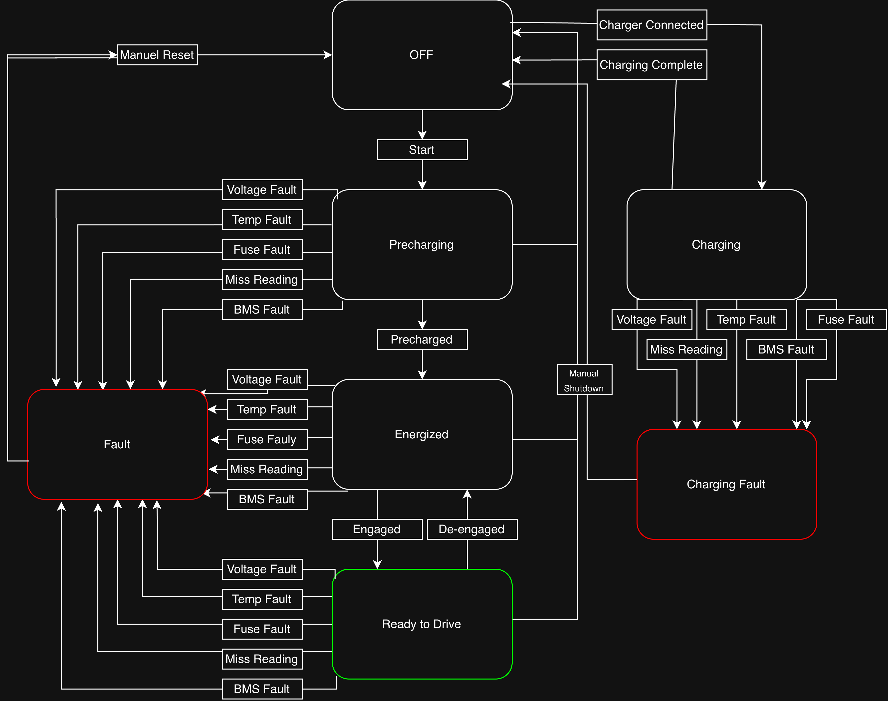

# BMS State Machine — SN5

## Build & Run
```
g++ -std=c++17 bms-state-machine.cpp -o main && ./main
```

## Architecture & Design
**Language & tools:** C++, using only the standard library (`<string>`, `<iostream>`, `<cstdlib>`, `<ctime>`). I did not use any external state-machine libraries. I chose to use C++ (despite never learning it before) because I knew it was commonly used in firmware and embedded systems and also because it would make enum/switch-based state machines more clean, which was a goal of mine.

**The core state machine:** My state machine consists of two enums, `State` and `Event`, and a singular function `transition(State, Event)` which returns a `State`. It is implemented as a nested switch. The outer switch narrows down to the current state, while the inner switch handles that state's valid events. Unhandled events fall through to `default: return current`, so unexpected input is safely ignored rather than corrupting state.

**Simulated CAN / sensor layer:** I implemented `checkVoltageMessage()` and `checkTempMessage()` act as decoders to take semi-random simulated sensor readings (min/max cell voltage or temperature) and translate them into a discrete `Event` (or `Event::None`), which then feeds into `transition()`. I chose this explicit separation, similar to the split between a real CAN RX handler and the control logic on a real BMS so the sensor layer and the state layer can be tested independently. The function `checkTempMessage()` also swaps its safe-range thresholds depending on whether the pack is charging or discharging, complying with the rulebook.

`bmsIsMonitoring()` is a bool to check whether the fake CAN tests can run at all, based on current state. This is per the rule that the BMS should only actively monitor cells while the tractive system is active or the pack is charging (EV.7.3.1), so I backed up this constraint in the code.

`randomInRange()` plus the batching in `runVoltageTest()`/`runTempTest()` simulate a noisy stream of readings, aggregating min/max over windows of 10 before evaluating a fault. This is meant to simulate how a real BMS polls and aggregates over a scan window instead of reacting to every single sample and test how the state machine responds to delayed inputs of events.

## Testing Approach
I implemented a REPL loop in `main()` to use plain-English strings (`"charger connected"`, `"brake pressed and button pressed"`) in the terminal to simulate sensor readings and map them to Events with the `checkEvent()` function. This simulates both driver actions and fault conditions that can be triggered manually, alongside the inputs `test can voltages`/`test can temps` commands that drive the randomized sensor simulation noted above.

## State Diagram

